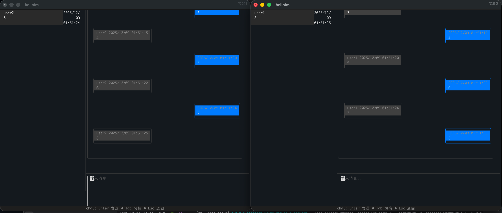

# Get Start
在运行项目之前，你需要安装docker(docker-compose)或者podman(podman compose), 用于在本地部署helloIm依赖的中间件。

启动脚本都已经编写在 deploy-dev 目录下，你可以查看 start.sh 和 docker-compose.yml。

推荐使用docker-desktop, 因为我用的docker-desktop，别忘了将host.docker.internal 指向 127.0.0.1，因为部署kafka的时候用得着。

第一步: 启动依赖的的中间件
```shell
cd deploy-dev && sh start.sh
```
过程中，你可能拉不到kafka的镜像，可以使用以下命令，从国内的镜像网站拉，然后换个tag.
```shell
docker pull swr.cn-north-4.myhuaweicloud.com/ddn-k8s/docker.io/bitnami/kafka:2.8.0
docker tag  swr.cn-north-4.myhuaweicloud.com/ddn-k8s/docker.io/bitnami/kafka:2.8.0  docker.io/bitnami/kafka:2.8.0
```
第二步:

使用任意一个可以连接mysql的工具，连接一下刚才启动的mysql服务，因为得事先连接下，不然store服务就连不上它，我也不知道为啥，懒得探究。
username: root, password: root

第三步:
打开idea, 逐个启动服务，不用改任何配置文件。
1. helloIm-Gateway: 长连接网关服务(目前只是基于TCP实现了私有协议, 不过你可以在里边找到多协议适配的设计和下行飞行队列的实现), TCP端口: 9300, WebContainer: 8081, dubbo端口: 28801
2. helloim-dispatch: 指令路由服务(解耦逻辑层和接入层, 理解为接入层的一个无状态服务, 减少接入层新增业务时的服务不可用的风险), WebContainer: 8080, dubbo端口: 28802
3. helloim-chatlist: 会话服务(目前只实现了单聊，单聊是写扩散设计), WebContainer: 8082, dubbo端口: 28803
4. helloim-session: 路由表(session)服务, WebContainer: 8083, dubbo端口: 28804
5. helloIm-message: 消息服务(单聊\群聊逻辑都得写在这里, 目前只实现了单聊，所以还看不到读写扩散的玩法)。WebContainer: 8084, dubbo端口: 28805
6. helloIm-delivery: 消息分发服务(查询路由表找到在线用户，然后发送消息到gateway, 这里也需要一些补偿逻辑，比如调用个推之类的)。WebContainer: 8085, dubbo: 28809
7. helloIm-store: 消息存储服务(分离存储和业务功能, 逻辑层不关注消息增么存，不关注如何分库分表，也可以在这里使用其他DB)。WebContainer: 8086, dubbo端口: 28806
8. helloIm-WebApi: 一个http服务，向外暴露一些service的功能。为什么使用http协议？因为http协议是世界上最灵活的协议(我本无意引战, orz)。WebContainer: 8087, dubbo端口: 28807
9. helloIm-user: 用户管理服务, 可以在这里管理社交关系，或者作为IM消息中台时, 在这里注册其他业务系统的用户。WebContainer: 8088, dubbo端口: 28808


第四步:

跳转到[helloImCli](https://github.com/xuning888/helloIMClient), 按照readme安装cli和启动它。

然后你就有一个可以消遣的玩具:


